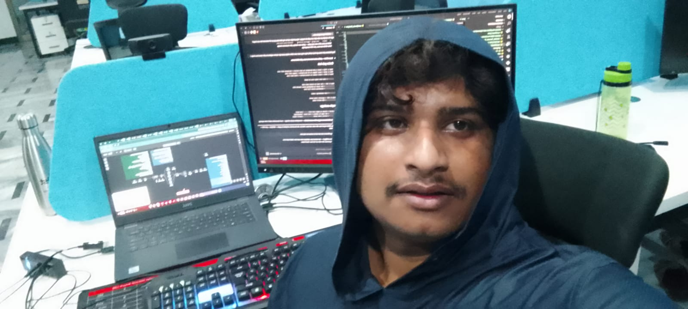
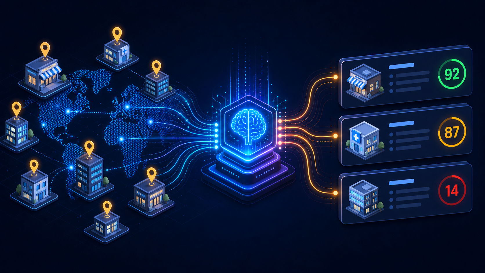
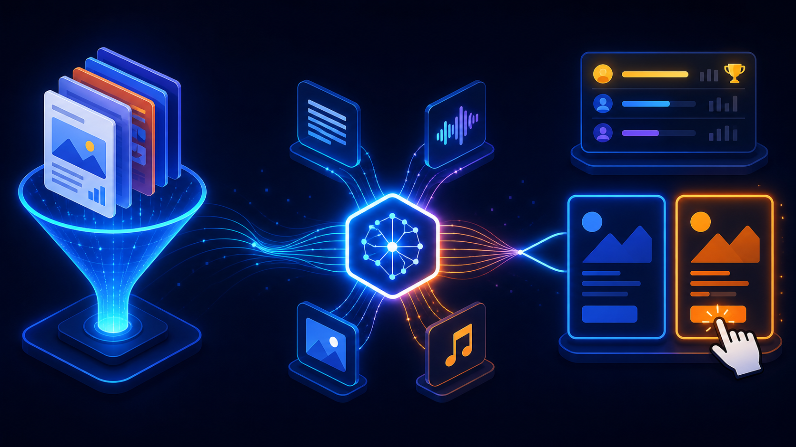
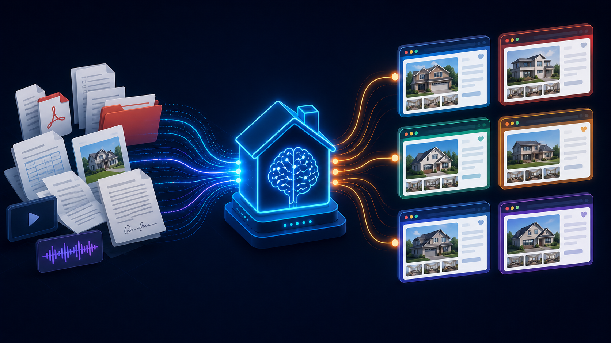
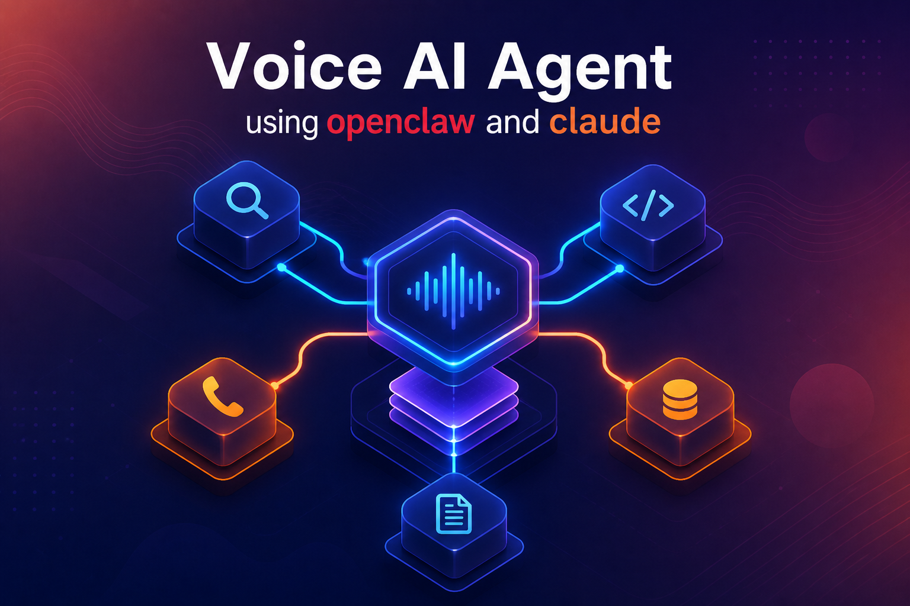
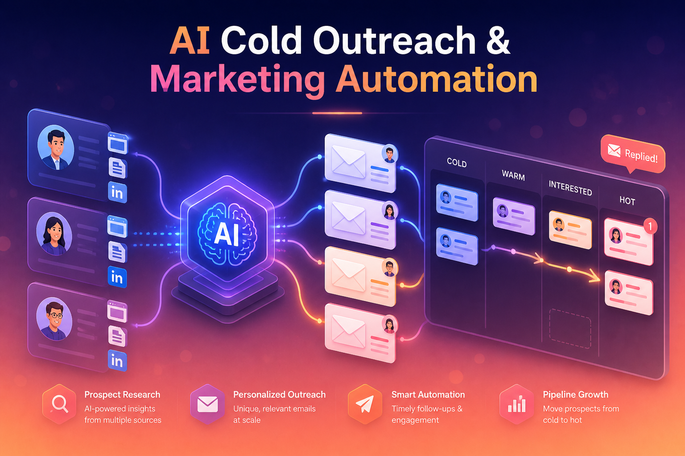
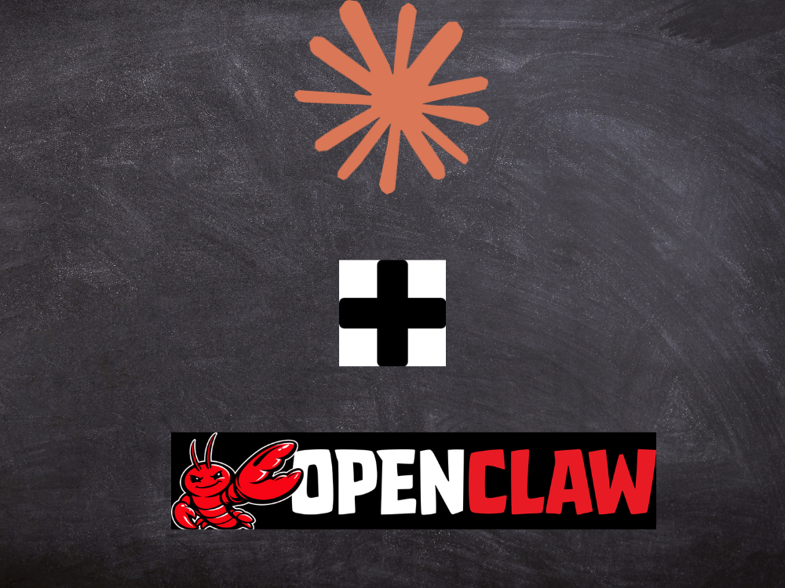
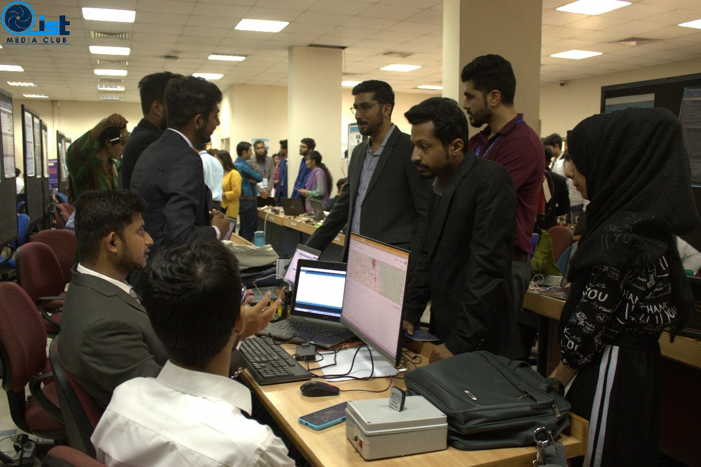
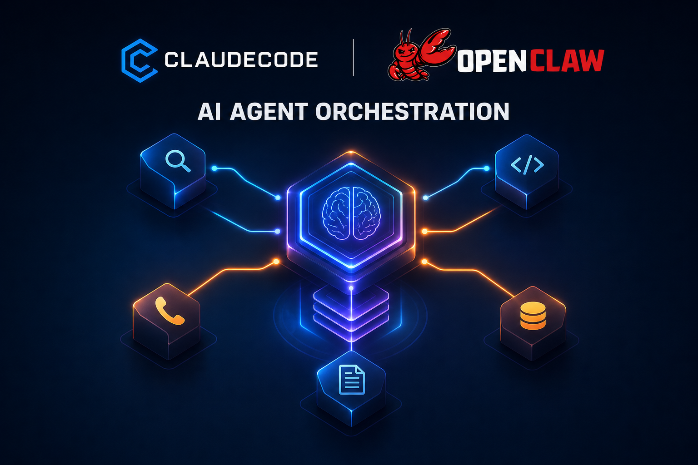

# Tanveer Hussain

**AI Automation Engineer · n8n Specialist · Distributed Systems Thinker**

Electrical engineer turned automation builder. I design AI systems that survive production, not just demos.

    

---

## From radar DSP to AI agents

I'm an electrical and communications engineer from the Institute of Space Technology, Islamabad. Before AI automation became my work, I spent years on radar signal processing and metamaterials research, the kind of problems where one wrong assumption breaks the entire signal chain and there's no LLM to paper over the failure. That hardware-first discipline is the lens I bring to every software system I build today. Most automation builders learn the tool first and the engineering later. I came in the opposite direction, and it shows in the systems I ship.

Most automation people online treat n8n like a religion. I treat it like a tool. A useful one, often the right one, but a tool. When a client brings me a workflow problem, the first question I ask myself is whether the workflow should exist at all, not how to drag-and-drop it together. Half the automations people pay for are solving problems they manufactured by adopting the wrong stack three months earlier.

## The uncomfortable truth about AI agents in production

I think most AI agent demos on LinkedIn are theater. I've shipped enough RAG pipelines to know retrieval quality starts dying the moment your corpus crosses a few thousand documents and nobody set up reranking. I've watched voice synthesis costs blow up overnight because someone wired ElevenLabs into a loop with no async handling. I've seen n8n workflows with 80 nodes that should have been 12 nodes and a queue.

When I review an automation system, I look for where it will fail first. Tight coupling between orchestration and compute. Webhooks with no idempotency. Retry storms from chained nodes that nobody traced. Embedding drift that goes unmonitored because there's no observability layer. Single points of failure dressed up as "automation." That critical eye is the thing my clients actually pay for, even when they think they're paying for an n8n workflow.

## How the work actually gets done

Deep focus is my strongest tool. I can lock into a complex system for hours and hold the entire architecture in my head, but ordinary work slips if I don't have a system underneath me, so I built my own productivity layer on top of n8n and Telegram. It's the most useful thing I've ever automated, and no client will ever pay me for it.

I keep a research streak alongside the freelance grind. Physics-informed machine learning, weather prediction with graph neural networks, synthetic image detection. I co-authored work on gradient field and spectral slope analysis for detecting AI-generated images. The freelancing pays the bills. The research is who I am when nobody's watching.

## When the headphones go on

The deep-focus blocks are where the architectural decisions actually get made. Not in standups, not in proposals, not in scoping calls. When the headphones go on, the chat clients are muted, the day's other workflows are paused, and the only thing left is the system in front of me.

A long-running RAG pipeline, a misbehaving webhook chain, a graph neural network that will not converge, these are not problems you solve in fifteen-minute slices between meetings. They get solved in three-hour silences. The clients who hire me for the hard problems usually already understand this. The ones who don't, learn it by day three of the trial.

 

## What's broken about this industry

I'm tired of clients who want "AI agents" without understanding what autonomy actually costs in safety, observability, and execution control. I'm tired of proposals that sell magic. I'm tired of pretending that gluing an LLM to a Google Sheet counts as engineering. The honest version of this work is unglamorous. It's writing fallback logic. Monitoring token costs. Debugging a webhook that fires twice because someone skipped retry semantics.

What also wears me down: clients who go silent for days, then expect a turnaround in hours. Infrastructure or third-party services that don't respond on time when something needs to be debugged now. Expectations stretched far past the time budget, promising a week of work in two days, then surprised when something breaks. The work has a real shape and a real cost; pretending otherwise doesn't make it ship faster.

I'm a freelancer who refuses to be quiet about technical disagreements. I'll push back on a requirement that doesn't make sense. That has cost me work before. I'd rather lose a contract than ship something I know will break under load.

---

## How I approach the work

I don't limit myself to specific stacks, I pick up whatever is needed and get it done fast. My focus is on solving real problems, not just using tools. I build scalable, reliable systems instead of isolated features, and I'm comfortable working in complex, undefined environments. I turn rough ideas into structured, production-ready workflows.

I combine AI with engineering fundamentals like signal processing and control systems. My goal is to deliver practical solutions that actually work in real-world conditions.

---

## Systems that survived production

| | | |
|:---:|:---:|:---:|
|  |  |  |
| **Lead Generation Pipelines** | **Content Generation Platforms** | **RAG-based File Intelligence** |
|  |  |  |
| **Voice AI Agents** | **AI Cold Outreach & Marketing** | **OpenClaw + Claude Orchestration** |

**High-volume lead generation pipelines.** Scrapers processing 30,000+ records with self-healing retry logic, dynamic prompt engineering for structured data extraction, and multi-source enrichment across web and public data. n8n orchestration with Apify, Firecrawl, and LLM-driven validation layers.

**Content generation platforms.** End-to-end systems with LLM-powered draft improvement loops, A/B comparison interfaces, voice synthesis pipelines, and multi-format publishing. Flask backends with custom-branded frontends.

**RAG-based file intelligence systems.** PostgreSQL with pgvector pulling from cloud storage and shared drives. Whisper transcription for audio, OCR for scanned documents, semantic search across mixed file formats with hybrid retrieval.

**Multi-regional localization pipelines.** Translation and adaptation workflows for product copy across regions with QA layers, fallback logic, and human review gates.

**Customer support automation.** Gmail-integrated agents using LangChain with conversation memory, escalation routing, and human-in-the-loop safeguards.

**Voice agent integrations.** Telephony flows combining GoHighLevel with Retell AI, plus custom voice agents handling intake, qualification, and routing.

**Multi-platform social automation suites.** Six-plus interconnected workflows for ideation, generation, scheduling, and analytics on a single platform.

**Vertical news and digest engines.** RSS-driven content pipelines with LLM summarization and personalized email delivery.

**Scientific computing apps.** Streamlit deployments for domain-specific optimization problems including terahertz metamaterials and photonics.

### Research and academic work

- Co-authored research on synthetic image detection using gradient field and spectral slope analysis
- Working on physics-informed machine learning for atmospheric prediction with graph neural networks

 

#### The desk where the other half of the work happens

The freelance work pays the bills. The research runs on the other monitor. Atmospheric prediction with graph neural networks, terahertz metamaterial optimization, signal-detection problems left over from the radar work. None of this is on a deadline anyone is paying me to hit. All of it is what keeps me sharp on the engineer side, and most of the reason I see automation problems differently than someone who only ever did automation comes from this corner of the desk.

 

---

## The stack I actually ship with

### Automation and orchestration

     

### Languages and frameworks

     

### AI and LLMs

       

### Agent frameworks & runtimes (2026 stack)

      -10B981?style=for-the-badge&logoColor=white) 

### Data and RAG

    

### Web, scraping, and automation

   

### Integrations

     

### Deployment and DevOps

    

---

## The tools, with opinions

Badges are cheap. Here is how I actually use the things I named above, and where I have already watched them break.

### Claude and Claude Code

Claude is my default model the moment a task needs real reasoning, long-context work, or instruction-following that does not drift after the third turn. Sonnet for cost-sensitive workloads, Opus when the answer matters more than the latency. Claude Code is the bigger shift though. It is the first agent runtime I have used that actually reads the codebase before editing, instead of pattern-matching from a single open file. I run it with custom hooks, tight permission scopes, and skills tuned to the client's stack. Cowork-style pairing is fine for spiking, but the real leverage is letting Claude Code own a feature end-to-end with proper guardrails, then reviewing the diff like I would a junior engineer's PR.

### OpenAI agents, Assistants API, Agents SDK

GPT still has the edge on tool-call latency and ecosystem maturity, and I reach for it when a client is already standardized on OpenAI or when function calling has to be sub-second. Where I push back: smaller GPT models hallucinate tool arguments under load, and the Assistants API hides too much state for systems that need to be debuggable at 2 AM. For anything multi-step in production I pin model versions, log every tool call with arguments and timings, and never trust a streaming response without an end-of-stream sentinel. The new Agents SDK is promising for orchestration, but I still wrap it in my own observability layer before it touches a client's billing.

### Playwright

The default for any scraping or browser automation that has to survive past a week. Auto-wait, tracing, codegen, and headless reliability make it a five-times productivity gain over Selenium for new work. I run it inside Docker for client systems, with stealth plugins where the target site warrants it, and persistent storage state to avoid re-auth on every job. Anti-bot detection has caught up to most public scripts. Sometimes the answer is residential proxies and request shaping. Sometimes the honest answer is that scraping is the wrong tool and the client should be paying for the API. I tell them either way.

### LangChain and LangGraph

LangChain for prototyping and quickly chaining LLM calls with retrievers. I avoid its heavier abstractions in production because too many layers sit between me and the actual API call when something breaks. LangGraph earns its place when the workflow is genuinely graph-shaped, needs persistent state across nodes, and has branches, retries, or human-in-the-loop steps. If your "agent" is really a sequential pipeline, you do not need LangGraph. If it is a real state machine with conditional edges, LangGraph saves you from rebuilding one badly.

### RAG with pgvector, Pinecone, and ChromaDB

pgvector wins for production by default because the ops team already knows how to back up Postgres, run replicas, and read query plans. Pinecone when you need scale beyond what a single instance gives you, or when latency budgets are aggressive. ChromaDB is fine for prototyping and notebooks. Reranking is non-negotiable past a few thousand documents, a vector hit is not the same as a relevant hit. Hybrid search, BM25 plus dense embeddings, beats pure semantic for almost every real knowledge base I have shipped. Chunking strategy matters more than which vector store you picked.

### Voice agents with Vapi, Retell, ElevenLabs, and Whisper

Vapi for telephony orchestration when you want a clean abstraction over Twilio, Retell when the GoHighLevel integration is the constraint, ElevenLabs for synthesis quality where the brand voice has to feel real. Watch the cost. Voice can blow a monthly budget faster than any other line item if you wire it into a loop without async handling, idempotency on retries, and a hard cap on per-call duration. Whisper for transcription, distil-whisper or faster-whisper for production where latency matters and the GPU bill does not.

### n8n, when it earns its place

n8n is the right tool when the workflow is genuinely visual, has clear stages, and needs to be inspectable by a non-engineer on the client's side. It is the wrong tool when the logic has heavy branching that becomes unreadable as nodes, when you need real version control over the logic, or when latency matters at the millisecond level. Switch to code nodes early, do not be precious about staying inside the visual canvas. Run queue mode with dedicated workers in production. Break anything past twenty nodes into sub-workflows. Most of the n8n workflows I am paid to fix were one architectural decision away from being clean.

### Docker, FastAPI, and the boring infrastructure underneath

Every system I ship sits on a small set of unglamorous primitives. Docker for reproducibility and clean handoff. FastAPI when the workflow needs an actual HTTP layer with validation and async support. Redis for queues, rate limits, and short-lived caches. PostgreSQL for everything else. GitHub Actions for CI on the deployable parts. None of this is exciting on a portfolio page. All of it is what makes the AI layer on top stop falling over at 3 AM.

---

## Featured project

| Project | Stack | Repo |
|---|---|---|
| **n8n Automation 2025, AI Agent Suite** | n8n · Claude · OpenAI · LangChain · PostgreSQL · pgvector · Redis · FastAPI · Docker | [github.com/tannu64/n8n-automation-2025-AI-Agent-Suite](https://github.com/tannu64/n8n-automation-2025-AI-Agent-Suite) |

---

## Side projects worth a name

**OpenClaw** is the orchestration runtime I have been building when client work isn't filling the calendar. The brief: an agent runtime that treats workflow control as a first-class problem instead of a side effect of the LLM. Less drag-and-drop, more state machines and explicit edges. **Hermes Agents** is the companion library on top, the actual agent definitions, tool wiring, and observability layer. Both repos are live on my GitHub and both are still under heavy iteration.

If you want to know where I think n8n's ceiling is, OpenClaw is what's on the other side of it. Most automation tools optimize for the first ten workflows you build. OpenClaw is being designed for the hundredth one, where state, retries, and recovery have to be first-class concerns rather than nodes you wire in by accident.

 

---

## Where I'm taking this next

I want to move from contractor to system designer. The kind of work where the question isn't "build me a workflow" but "tell me why my stack will collapse at 10x scale and fix it." OpenClaw and Hermes agents are already done, portfolio projects for both are live on my GitHub ([github.com/tannu64](https://github.com/tannu64)). I'm spending 2026 going deeper into Claude Code and proper agent runtimes, because the next layer of this industry isn't drag-and-drop anymore. It's distributed systems thinking applied to language models, and most of the field hasn't caught up yet.

---

## How I work with clients

English. Concise. Direct. I'll tell you "this won't scale" before I start, not after the invoice. I offer a 72-hour free trial because I'd rather you fire me on day three than pay for a month of misaligned expectations.

If you want a yes-man with a no-code certificate, I'm not the guy. If you want someone who will tell you your RAG is garbage and then fix it, we'll get along.

### What I look for in a client

- **Calm, clear communicators.** Walk me through your business requirements like an adult conversation, not a panic.
- **Uses a project management tool.** Jira, ClickUp, or Linear, pick one. A shared source of truth beats Slack threads and lost context.
- **Someone I can update daily.** Written status, plus Loom recordings when a workflow needs to be shown, not described.
- **Patient with timezones, strict on responsiveness.** Don't stress about the exact hours I work, judge me on whether I reply in time and ship on time.

### What I commit to

- Systems that stay stable in production, not demos that crack on the first real load.
- Results-oriented work, every workflow I ship has to do a job, not just look impressive in a screenshot.

---

## Connect

- **Upwork:** [100% Job Success profile](https://www.upwork.com/freelancers/~01a14d825a9bd8689d)
- **LinkedIn:** [tanveer-hussain-277119196](https://www.linkedin.com/in/tanveer-hussain-277119196/)
- **GitHub:** [tannu64](https://github.com/tannu64), OpenClaw, Hermes, and portfolio projects
- **Email:** [agapaitanveermou@gmail.com](mailto:agapaitanveermou@gmail.com)
- **Hourly rate:** $20/hour
- **Languages:** English
